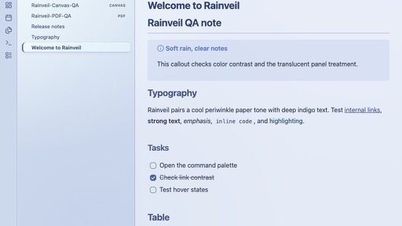
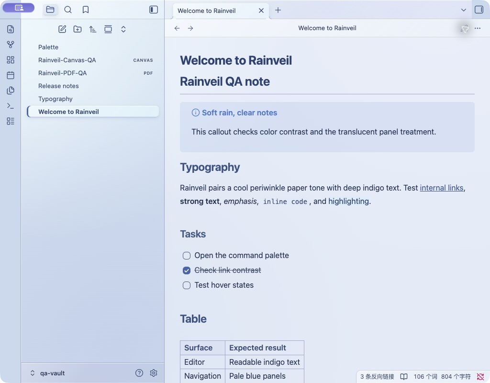
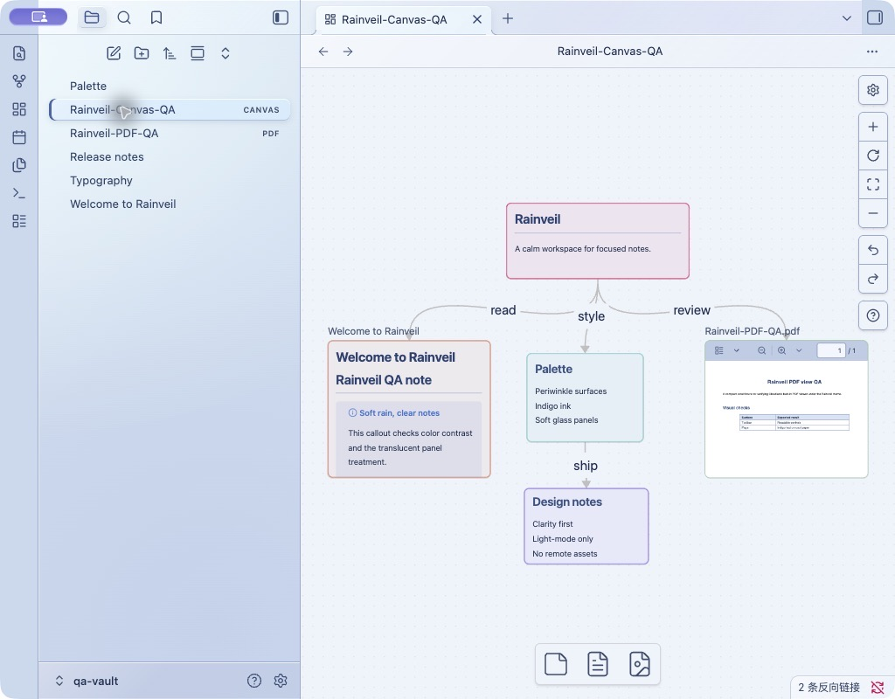
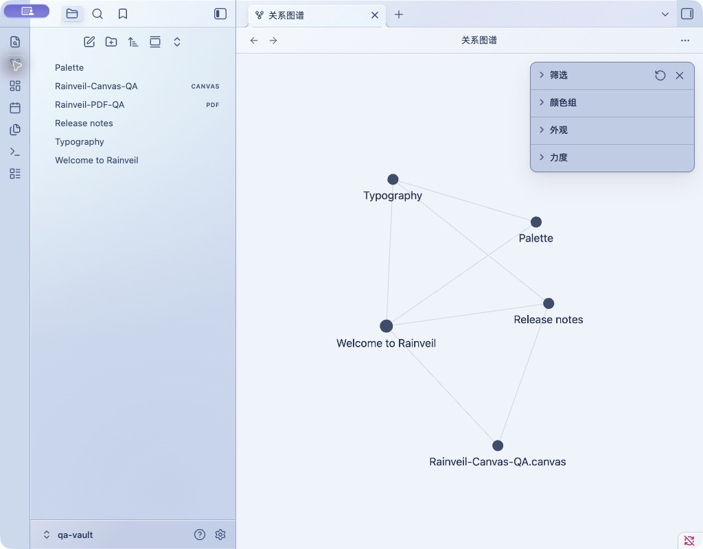
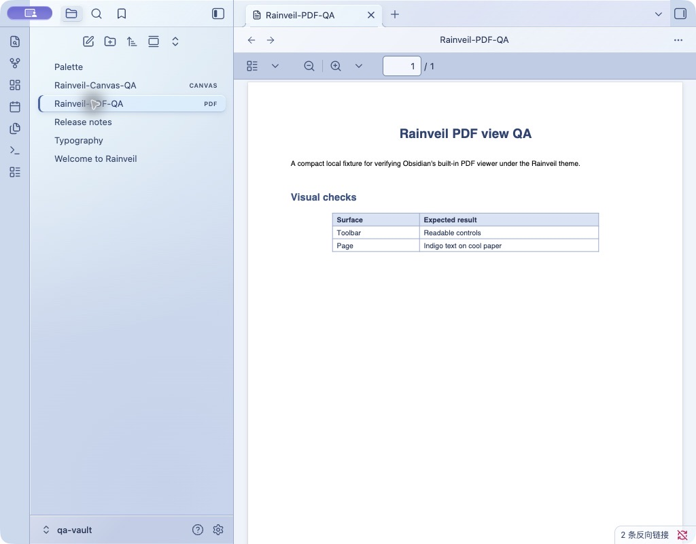

# Rainveil

A light-only Obsidian theme with a cool periwinkle palette, misted glass surfaces, and deep indigo text. Rainveil gives the workspace a soft, rainy-day atmosphere while keeping notes clear and readable.



## In Obsidian

| Reading view | Canvas |
| --- | --- |
|  |  |

| Graph view | PDF view |
| --- | --- |
|  |  |

## Features

- Pale blue paper tones with indigo text and accents.
- Translucent workspace chrome and softly blurred floating panels.
- Styling for Markdown, navigation, tabs, forms, and the built-in PDF view.
- Reduced-transparency and no-backdrop-filter fallbacks.
- No remote fonts, images, or other network-loaded assets.

## Install from this repository

Copy `theme.css` and `manifest.json` into a folder named `Rainveil` under your vault's `.obsidian/themes/` directory:

```text
<your-vault>/.obsidian/themes/Rainveil/
```

Then choose **Settings → Appearance → Themes → Rainveil**.

## Supported appearance

Rainveil is designed for Obsidian's **Light** mode. Dark mode is not currently styled. When submitting this theme to the Community Directory, select **Light** only.

## Compatibility

The stylesheet uses the CSS `:has()` selector and `backdrop-filter`. Older installers may not support every effect. The stylesheet includes fallbacks, but performance and compatibility should be checked in Canvas, on mobile, and with reduced transparency before a release.

## Release

For each release, update `version` in `manifest.json` using `x.y.z` format. Create a GitHub Release with the exact same tag, and attach `manifest.json` and `theme.css`. The initial Community Directory submission also requires a screenshot and review through the official [theme submission guide](https://docs.obsidian.md/themes/app-themes/submit-theme).

## License

Rainveil is available under the [MIT License](./LICENSE).
